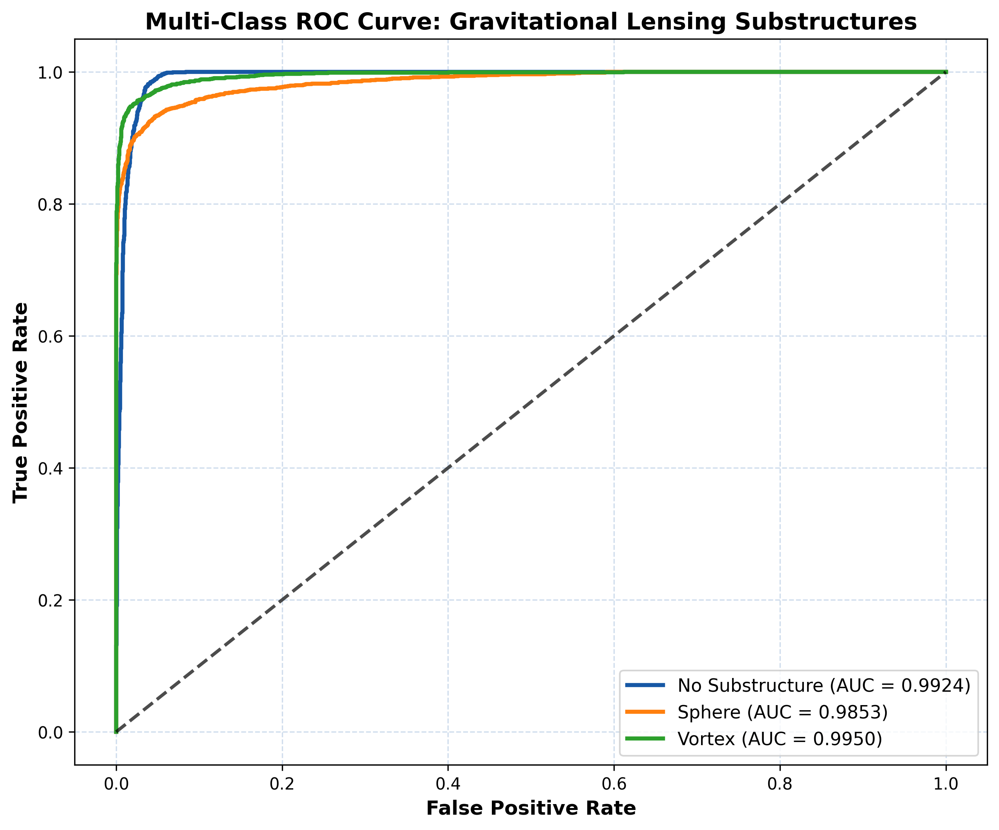
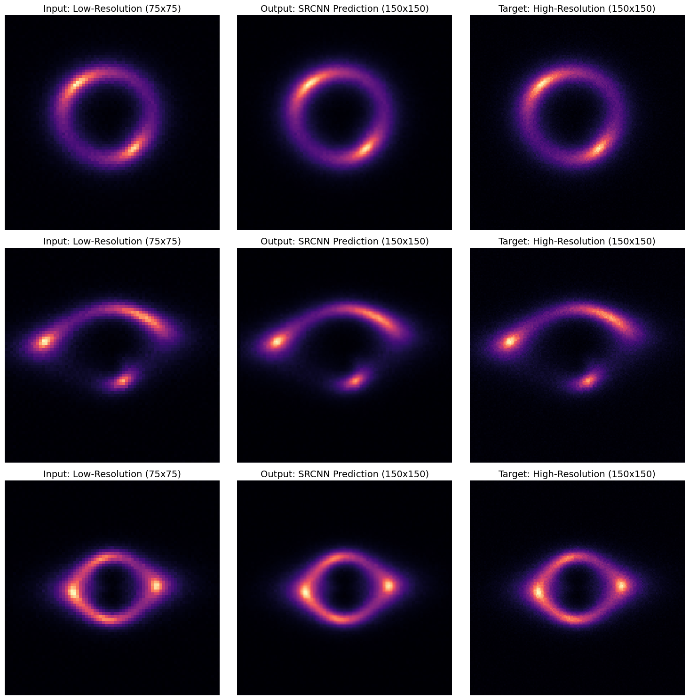
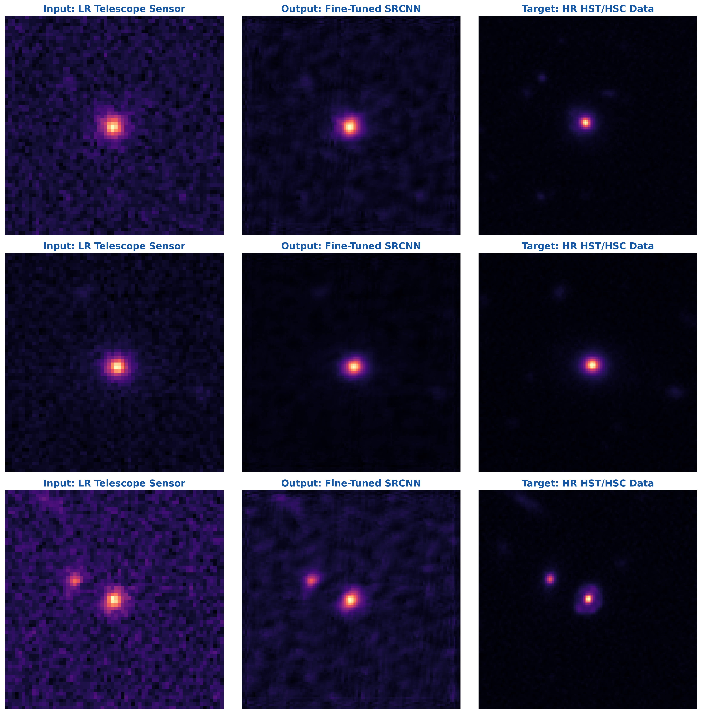

# DeepLense: Dark Matter Substructure Detection & Super-Resolution
**Google Summer of Code 2026 Evaluation Repository | Machine Learning for Science (ML4Sci)**

GSoC 2026 ML4Sci DeepLense: Common Task I &amp; Specific Task VI (A &amp; B) (Super-resolution)

[](https://www.linkedin.com/in/kartikchavan01/)
[]()
[]()

This repository contains my completed evaluation tasks for the ML4Sci DeepLense project. Rather than relying on standard supervised tutorials, these architectures were custom-engineered specifically for the sparse, high-variance nature of astrophysical data.

---

##  Evaluation Tasks & Metrics

### 1. Common Task I: Multi-Class Classification
**Goal:** Classify 1-channel grayscale lensing images into No Substructure, Sphere, and Vortex.
* **Architecture:** Adapted `timm`-backed ResNet18 optimized for 1-channel sparse inputs.
* **Engineering:** Implemented `CosineAnnealingLR` and strict dynamic model checkpointing (tracking `val_loss`) to completely avoid overfitting to sensor noise.
* **Results:** Near-perfect classification metrics mapped with domain-standard colormaps.
    * **AUC (No Substructure):** 0.9924
    * **AUC (Sphere):** 0.9853
    * **AUC (Vortex):** 0.9950



### 2. Specific Task VI.A: Super-Resolution (Simulated Data)
**Goal:** Upscale 75x75 sparse arrays to 150x150 to recover fine-grained dark matter details.
* **Architecture:** Custom Super-Resolution Convolutional Neural Network (SRCNN).
* **Engineering:** Standard MSE loss blurs microscopic anomalies and standard SSIM breaks on 90% zero-variance black space. I engineered a custom α-blended structural loss function: `Loss = α * MSE + (1 - α) * (1 - SSIM)` to force the network to learn physical structures.
* **Results:** Artifact-free reconstructions with a **41.32 dB PSNR**.



### 3. Specific Task VI.B: Domain Adaptation (Real HST/HSC Data)
**Goal:** Fine-tune the SR model on an ultra-small dataset of 300 real telescope image pairs.
* **Architecture:** Transfer Learning pipeline injecting Task VI.A physics-aware weights.
* **Engineering:** Built a custom `RealTelescopeDataset` to automatically sanitize 5D tensor anomalies from raw telescope extractions. Implemented **paired geometric augmentations** to artificially expand the dataset while preserving spatial relativity.
* **Results:** Successfully adapted to real sensor noise without catastrophic forgetting.
    * **SSIM:** 0.8355
    * **PSNR:** 31.99 dB



---

##  GSoC 2026: The Summer Blueprint
While the evaluation tasks required supervised learning, my official GSoC proposal pivots to **Unsupervised Generative Super-Resolution** to bridge the "simulated-to-real" domain gap. 

Building upon recent DeepLense literature (e.g., Reddy et al., 2024), the final cell of the `03_Task_VI_B_TransferLearning.ipynb` notebook contains my preliminary PyTorch architectural blueprint for an Unsupervised Score-Based Generative Model (NCSN++) utilizing Predictor-Corrector sampling to infer missing high-frequency structures from unpaired empirical data.

[📄 Read my official GSoC 2026 Proposal Here](Kartik_Chavan_DeepLense_Proposal.pdf)

---

##  Reproducibility & Installation

To run the notebooks locally and reproduce the metrics:

```bash
# 1. Clone the repository
git clone [https://github.com/Chavan-Kartik/DeepLense-GSoC26.git](https://github.com/Chavan-Kartik/DeepLense-GSoC26.git)
cd DeepLense-GSoC26

# 2. Create a virtual environment
python -m venv venv
source venv/bin/activate  # On Windows use `venv\Scripts\activate`

# 3. Install dependencies
pip install -r requirements.txt

# 4. Run the Pipeline Unit Test
# This script verifies that the local data directories are correctly mapped 
# and that the PyTorch DataLoaders are correctly extracting 1-channel tensors.
python test_pipeline.py